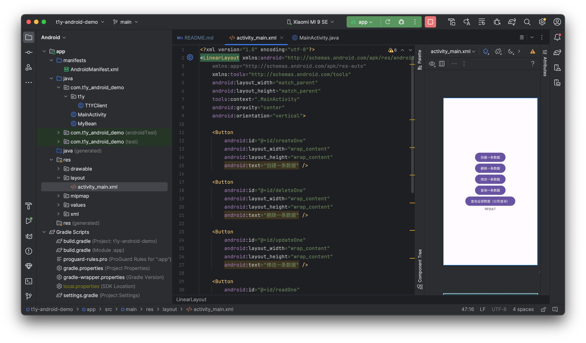

T1 后端云 Android 例子

本文档是 T1 后端云 官方提供的 Android 例子，方便 Android 开发人员快速使用 T1 进行后端开发。



# 前期准备

## 克隆代码

```shell
git clone git@github.com:t1ykf/t1y-android-demo.git
```

# 使用说明

将 `app/src/main/java/com/t1y_android_demo/t1y/T1YClient.java` 复制到您自己的 Android 项目中，修改包名，并继续。

## 添加依赖

```gradle
implementation 'com.squareup.okhttp3:okhttp:4.11.0'
implementation 'com.google.code.gson:gson:2.10.1'
```

## 配置权限

```xml
<!-- 访问网络权限 -->
<uses-permission android:name="android.permission.INTERNET" />
<!-- 访问网络状态权限 -->
<uses-permission android:name="android.permission.ACCESS_NETWORK_STATE" />
<!-- 访问Wi-Fi状态权限 -->
<uses-permission android:name="android.permission.ACCESS_WIFI_STATE" />
```

## 配置允许 HTTP 访问（可选）

如果你的应用目标为 Android 9（API 级别 28）或更高版本，还需要在清单文件中明确声明允许使用 HTTP 的域名。这可以通过在 `AndroidManifest.xml` 中的 `<application>` 元素内部添加以下内容来完成：

```xml
android:usesCleartextTraffic="true"
```

# 封装说明

- 创建 Gson 和 T1YClient 对象

```java
// 创建一个 Gson 对象
Gson gson = new Gson();
// 创建一个 T1YClient 对象
T1YClient t1y = new T1YClient("您已备案域名", 您的应用 ID, "您的应用 API Key", "您的应用 Secret Key");
```

- 添加一条数据

```java
MyBean myBean = new MyBean("王华", 21, "男");
String data = t1y.createOne("student", myBean);
```

或

```java
Map<String, Object> jsonMap = new HashMap<>();
jsonMap.put("name", "王华");
jsonMap.put("age", 21);
jsonMap.put("sex", "男");
String data = t1y.createOne("student", jsonMap);
```

或

```java
JsonObject jsonObject = new JsonObject();
jsonObject.addProperty("name", "王华");
jsonObject.addProperty("age", 21);
jsonObject.addProperty("sex", "男");
String data = t1y.createOne("student", jsonObject);
```

- 删除一条数据

```java
String data = t1y.deleteOne("student", "65431d617ed5bb441885c097");
```

- 更新一条数据

```java
MyBean myBean = new MyBean("王华", 22, "男");
JsonObject jsonObject = new JsonObject();
jsonObject.add("$set",(JsonObject) gson.toJsonTre(myBean));
String data = t1y.updateOn("student", "65431b5f7ed5bb441885c095", jsonObject);
```

- 查询一条数据

```java
String data = t1y.findOne("student", "65431b5f7ed5bb441885c095");
```

- 查询全部数据（分页查询）

```java
String data = t1y.findAll("student", 1, 10);
```

- 调用云函数

```java
JsonObject params = new JsonObject();
params.addProperty("key1", "value1");
params.addProperty("key2", "value2");
params.addProperty("key3", "value3");
String data = t1y.findOne("hello", params); // 调用 hello 云函数，并传递 params 数据
```

```js
function main() {
    const params = ctx.getBody() // 获取 android 传递的 params 数据
    console.log(params) // 打印 params 数据
    return 'Callback!' // 返回给 android 的数据
}
```

更多完整使用方法，请参考：`app/src/main/java/com/t1y_android_demo/t1y/T1YClient.java` Java 封装！

# 运行效果

**MainActivity.java**

```java
package com.t1y_android_demo;

import androidx.appcompat.app.AppCompatActivity;

import android.os.Bundle;
import android.util.Log;
import android.view.View;
import android.widget.Button;
import android.widget.TextView;
import android.widget.Toast;

import com.google.gson.Gson;
import com.google.gson.JsonObject;
import com.t1y_android_demo.t1y.T1YClient;

import org.json.JSONException;

public class MainActivity extends AppCompatActivity {

    private Button createOne, deleteOne, updateOne, findOne, findAll;
    private TextView result;

    @Override
    protected void onCreate(Bundle savedInstanceState) {
        super.onCreate(savedInstanceState);
        setContentView(R.layout.activity_main);

        // 创建一个 Gson 对象
        Gson gson = new Gson();

        // 创建一个 T1YClient 对象
        T1YClient t1y = new T1YClient("https://api.t1y.net", "1001", "2c6118c4e02b40fe96f5c40ee1dc5561", "650bd657da0243b282d9cab6d75a80ff");

        result = findViewById(R.id.result);

        createOne = findViewById(R.id.createOne);
        deleteOne = findViewById(R.id.deleteOne);
        updateOne = findViewById(R.id.updateOne);
        findOne = findViewById(R.id.findOne);
        findAll = findViewById(R.id.findAll);

        createOne.setOnClickListener(new View.OnClickListener() {
            @Override
            public void onClick(View view) {
                new Thread(new Runnable() {
                    @Override
                    public void run() {
                        MyBean myBean = new MyBean("王华", 21, "男");
                        String data = t1y.createOne("student", myBean); // 向 student 集合中添加一条数据
                        createOne.post(new Runnable() {
                            @Override
                            public void run() {
                                result.setText(data);
                                Toast.makeText(MainActivity.this, data, Toast.LENGTH_SHORT).show();
                            }
                        });
                    }
                }).start();
            }
        });

        deleteOne.setOnClickListener(new View.OnClickListener() {
            @Override
            public void onClick(View view) {
                new Thread(new Runnable() {
                    @Override
                    public void run() {
                        String data = t1y.deleteOne("student", "65431d617ed5bb441885c097"); // 删除 student 集合中 ObjectID 为 65431d617ed5bb441885c097 的数据
                        createOne.post(new Runnable() {
                            @Override
                            public void run() {
                                result.setText(data);
                                Toast.makeText(MainActivity.this, data, Toast.LENGTH_SHORT).show();
                            }
                        });
                    }
                }).start();
            }
        });

        updateOne.setOnClickListener(new View.OnClickListener() {
            @Override
            public void onClick(View view) {
                new Thread(new Runnable() {
                    @Override
                    public void run() {
                        MyBean myBean = new MyBean("王华", 22, "男");
                        JsonObject jsonObject = new JsonObject();
                        jsonObject.add("$set", (JsonObject) gson.toJsonTree(myBean));
                        Log.i("DATA", jsonObject.toString());
                        String data = t1y.updateOne("student", "65431b5f7ed5bb441885c095", jsonObject); // 修改 student 集合中 ObjectID 为 65431b5f7ed5bb441885c095 的数据
                        createOne.post(new Runnable() {
                            @Override
                            public void run() {
                                result.setText(data);
                                Toast.makeText(MainActivity.this, data, Toast.LENGTH_SHORT).show();
                            }
                        });
                    }
                }).start();
            }
        });

        findOne.setOnClickListener(new View.OnClickListener() {
            @Override
            public void onClick(View view) {
                new Thread(new Runnable() {
                    @Override
                    public void run() {
                        String data = t1y.findOne("student", "65431b5f7ed5bb441885c095"); // 查询 student 表中 ObjectID 为 65431b5f7ed5bb441885c095 的数据
                        createOne.post(new Runnable() {
                            @Override
                            public void run() {
                                result.setText(data);
                                Toast.makeText(MainActivity.this, data, Toast.LENGTH_SHORT).show();
                            }
                        });
                    }
                }).start();
            }
        });

        findAll.setOnClickListener(new View.OnClickListener() {
            @Override
            public void onClick(View view) {
                new Thread(new Runnable() {
                    @Override
                    public void run() {
                        String data = t1y.findAll("student", 1, 10); // 查询 student 集合中第1页的全部数据，每页10条
                        createOne.post(new Runnable() {
                            @Override
                            public void run() {
                                result.setText(data);
                                Toast.makeText(MainActivity.this, data, Toast.LENGTH_SHORT).show();
                            }
                        });
                    }
                }).start();
            }
        });
    }
}
```

**T1YClient.java**

其中 `Fisher-Yates 洗牌加解密算法` 是可选的，你可以使用它们混淆您的应用 ID、应用 API Key、应用 Secret Key，增加阅读难度及安全性，当然您也可以自定义算法！

```java
package com.t1y_android_demo.t1y;

import android.util.Log;

import com.google.gson.Gson;
import com.google.gson.JsonObject;

import java.security.MessageDigest;
import java.security.NoSuchAlgorithmException;
import java.util.Random;

import okhttp3.HttpUrl;
import okhttp3.MediaType;
import okhttp3.OkHttpClient;
import okhttp3.Request;
import okhttp3.RequestBody;
import okhttp3.Response;

public class T1YClient {
    private OkHttpClient client;
    private Gson gson;
    private String baseUrl;
    private String appId;
    private String apiKey;
    private String secretKey;

    /**
     * 初始化 T1YClient
     * @param baseUrl 您已备案域名（例如：https://api.t1y.net）
     * @param appId 应用ID（你可以使用混淆算法将字符串混淆后解密传入 T1YClient 中，增加安全性）
     * @param apiKey 应用 API Key（你可以使用混淆算法将字符串混淆后解密传入 T1YClient 中，增加安全性）
     * @param secretKey 应用 Secret Key（你可以使用混淆算法将字符串混淆后解密传入 T1YClient 中，增加安全性）
     */
    public T1YClient(String baseUrl, String appId, String apiKey, String secretKey) {
        this.client = new OkHttpClient();
        this.gson = new Gson();
        this.baseUrl = baseUrl;
        this.appId = appId;
        this.apiKey = apiKey;
        this.secretKey = secretKey;
    }

    /**
     * 添加一条数据
     * @param collection 集合名
     * @param params 数据（JSON 格式）
     */
    public <T> String createOne(String collection, T params) {
        return request("/v5/classes/" + collection, gson.toJson(params), "POST");
    }

    /**
     * 删除一条数据
     * @param collection 集合名
     * @param objectId 需要删除数据的 ObjectID
     */
    public String deleteOne(String collection, String objectId) {
        return request("/v5/classes/" + collection + "/" + objectId, null, "DELETE");
    }

    /**
     * 更新一条数据
     * @param collection 集合名
     * @param objectId 需要更新数据的 ObjectID
     * @param params 参数（详细文档&示例见：https://t1y.net/docs/data/update-one.html && https://t1y.net/docs/function/update-one.html）
     * @return
     * @param <T>
     */
    public <T> String updateOne(String collection, String objectId, T params) {
        return request("/v5/classes/" + collection + "/" + objectId, gson.toJson(params), "PUT");
    }

    /**
     * 查询一条数据
     * @param collection 集合名
     * @param objectId 需要查询数据的 ObjectID
     */
    public String findOne(String collection, String objectId) {
        return request("/v5/classes/" + collection + "/" + objectId, null, "GET");
    }

    /**
     * 查询全部数据（分页查询）
     * @param collection 集合名
     * @param page 页码
     * @param size 每页条目数
     */
    public String findAll(String collection, int page, int size) {
        return request("/v5/classes/" + collection + "?page=" + page + "&size=" + size, null, "GET");
    }

    /**
     * 批量添加数据
     * @param collection 集合名
     * @param params 参数（详细文档&示例见：https://t1y.net/docs/data/create-batch.html && https://t1y.net/docs/function/create-many.html）
     */
    public <T> String createMany(String collection, T params) {
        return request("/v5/classes/" + collection + "/batch", gson.toJson(params), "POST");
    }

    /**
     * 批量删除数据
     * @param collection 集合名
     * @param params 参数（详细文档&示例见：https://t1y.net/docs/data/delete-batch.html && https://t1y.net/docs/function/delete-many.html）
     */
    public <T> String deleteMany(String collection, T params) {
        return request("/v5/classes/" + collection + "/batch", gson.toJson(params), "DELETE");
    }

    /**
     * 批量更新数据
     * @param collection 集合名
     * @param params 参数（详细文档&示例见：https://t1y.net/docs/data/update-batch.html && https://t1y.net/docs/function/update-many.html）
     */
    public <T> String updateMany(String collection, T params) {
        return request("/v5/classes/" + collection + "/batch", gson.toJson(params), "PUT");
    }

    /**
     * 高级查询（分页、排序、比较）
     * @param collection 集合名
     * @param filter or body 过滤器（详细文档&示例见：https://t1y.net/docs/data/query.html && https://t1y.net/docs/function/query.html）
     * @param page 页码
     * @param size 每页条目数
     * @param sort 排序（-1 为降序，1 为升序）（详细文档&示例见：https://t1y.net/docs/data/query.html && https://t1y.net/docs/function/query.html）
     */
    public <T> String query(String collection, T filter, int page, int size, T sort) {
        JsonObject jsonObject = new JsonObject();
        jsonObject.add("body", gson.toJsonTree(filter));
        jsonObject.addProperty("page", page);
        jsonObject.addProperty("size", size);
        jsonObject.add("sort", gson.toJsonTree(sort));
        return request("/v5/classes/" + collection + "/query", gson.toJson(jsonObject), "POST");
    }

    /**
     * 聚合查询（分组、聚合、运算）
     * @param collection 集合名
     * @param params 聚合查询请求体（详细文档&示例见：https://t1y.net/docs/data/aggregate.html && https://t1y.net/docs/function/aggregate.html）
     */
    public <T> String aggregate(String collection, T params) {
        return request("/v5/classes/" + collection + "/aggregate", gson.toJson(params), "POST");
    }

    /**
     * 查询所有集合
     */
    public String getAllCollections() {
        return request("/v5/schemas", null, "GET");
    }

    /**
     * 创建集合
     * @param collection 集合名
     */
    public String createCollection(String collection) {
        return request("/v5/schemas/" + collection, null, "POST");
    }

    /**
     * 清空集合（⚠️ 危险操作，谨慎使用！）
     * @param collection 集合名
     */
    public String clearCollection(String collection) {
        return request("/v5/schemas/" + collection, null, "PUT");
    }

    /**
     * 删除集合（⚠️ 危险操作，谨慎使用！）
     * @param collection 集合名
     */
    public String deleteCollection(String collection) {
        return request("/v5/schemas/" + collection, null, "DELETE");
    }

    /**
     * 发送邮件
     * @param to 接收者邮箱地址
     * @param subject 标题
     * @param body 邮件内容（支持 html）
     */
    public String sendEmail(String to, String subject, String body) {
        JsonObject jsonObject = new JsonObject();
        jsonObject.addProperty("to", to);
        jsonObject.addProperty("subject", subject);
        jsonObject.addProperty("body", body);
        return request("/v5/sys/email", gson.toJson(jsonObject), "POST");
    }

    /**
     * 获取短信验证码
     * @param phone 接收验证码的手机号
     */
    public String sendSMSCode(String phone) {
        return request("/v5/sys/code?phone=" + phone, null, "GET");
    }

    /**
     * 调用指定云函数
     * @param name 函数名
     * @param params 传递给函数的参数（JSON 类型）
     */
    public <T> String callFunc(String name, T params) {
        return request("/" + this.appId + "/" + name, gson.toJson(params), "POST");
    }

    /**
     * 请求封装
     * @param path 请求 URL 路径
     * @param params 提交参数（JSON 类型）
     * @param method 请求方法（GET、POST、PUT、DELETE）
     * @return body 响应体（JSON 类型）
     */
    public String request(String path, String params, String method) {
        RequestBody requestBody = null;
        if (!method.equals("GET") && params != null) {
            requestBody = RequestBody.create(params, MediaType.parse("application/json"));
        }
        String timestamp = String.valueOf(System.currentTimeMillis() / 1000);
        Request.Builder requestBuilder = new Request.Builder()
                .url(this.baseUrl + HttpUrl.parse(this.baseUrl + path).newBuilder().build().encodedPath())
                .method(method, requestBody)
                .header("Content-Type", "application/json")
                .header("X-T1Y-Application-ID", this.appId)
                .header("X-T1Y-Api-Key", this.apiKey)
                .header("X-T1Y-Safe-NonceStr", MD5(timestamp))
                .header("X-T1Y-Safe-Timestamp", timestamp)
                .header("X-T1Y-Safe-Sign", MD5(HttpUrl.parse(baseUrl + path).newBuilder().build().encodedPath() + this.appId + this.apiKey + MD5(timestamp) + timestamp + this.secretKey));
        Request request = requestBuilder.build();
        try {
            Response response = client.newCall(request).execute();
            String responseBody = response.body().string();
            Log.i("T1Y", responseBody);
            return responseBody;
        } catch (Exception e) {
            e.printStackTrace();
            return null;
        }
    }

    /**
     * MD5 加密
     * @param input 明文
     * @return 密文
     */
    public String MD5(String input) {
        try {
            MessageDigest md = MessageDigest.getInstance("MD5");
            byte[] inputBytes = input.getBytes("UTF-8");
            byte[] md5Bytes = md.digest(inputBytes);
            StringBuilder hexString = new StringBuilder();
            for (byte md5Byte : md5Bytes) {
                String hex = Integer.toHexString(0xFF & md5Byte);
                if (hex.length() == 1) {
                    hexString.append('0');
                }
                hexString.append(hex);
            }
            return hexString.toString();
        } catch (NoSuchAlgorithmException e) {
            e.printStackTrace();
            return null;
        } catch (Exception e) {
            e.printStackTrace();
            return null;
        }
    }

    /**
     * Fisher-Yates 洗牌算法（加密）
     * @param plainText 明文
     * @return 密文
     */
    public static String encrypt(String plainText) {
        char[] charArray = plainText.toCharArray();
        Random random = new Random();
        for (int i = charArray.length - 1; i > 0; i--) {
            int j = random.nextInt(i + 1);
            char temp = charArray[i];
            charArray[i] = charArray[j];
            charArray[j] = temp;
        }
        return new String(charArray);
    }

    /**
     * Fisher-Yates 洗牌算法（解密）
     * @param encryptedText 密文
     * @return 明文
     */
    public static String decrypt(String encryptedText) {
        char[] charArray = encryptedText.toCharArray();
        Random random = new Random();
        for (int i = charArray.length - 1; i > 0; i--) {
            int j = random.nextInt(i + 1);
            char temp = charArray[i];
            charArray[i] = charArray[j];
            charArray[j] = temp;
        }
        return new String(charArray);
    }
}
```